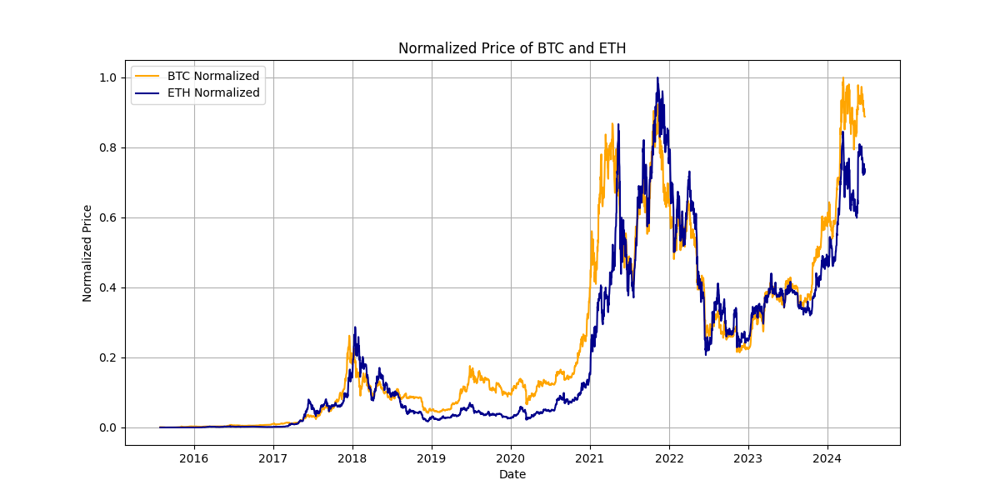

<div style="text-align: center;">
  <h1 style="font-size: 30px;">Does Ethereum copy Bitcoin ?</h1>
</div>


## Intro + Short talk
You have definitely heard of Bitcoin, digital cryptocurrency that is supposed to make things easier, but somehow doesnt. Many novices that touched it, managed to lost quite bit of money and in the end it actually worsened their financial situation.
Memories remain and regrets arises every now and then for not investing and hauling crypto soon enough, so in remorse people join the so called "pump n dump" scheme or also reffered as "bubble", meaning they buy at high price and not knowing 2 bits about the infrastructure, panic sell due to high volatility and get sidetracked to more safe investment opportunities (usually despite taking loss) such as stocks fiasco, instead of do a little bit of research.

Maybe its just my point of view, but closing market for a weekend and enforce personal information in order to invest or to pay tax because you are in unrealised profit is just widely accepted scam.

Well either way, ethereum is here and with its zero knowledge proves, L2s, privacy protection and (recent ETH 2.0) proof of stake mechanism things are ideologically promosing. Or are they?
With these great things built, ETH should take its lead and diverge, stand out as a cryptocurrency and rise, but nothing really happened, in fact it seems as if it has no impact whatsoever, as if people didnt care, which leads us to our H0 hypothesis:

Does Ethereum only copy bitcoin?

Or on the other hand, does it have its own drive and people differ ethereum from bitcoin and buy each independently?


## Procedure
The fisrt thing i did was to gather data, there is a [blockchair](https://blockchair.com) which provided me with historical prices of both coins in ".tsv" format. $\\$
Using python I parsed the data and thanks to wide range libraries, analysis was made easy - I used Engle-Granger 2step cointegration test which consists of regressing ETH to BTC and testing residuals by ADF, of course the daily average trading prices (data) have been normalized beforehand. $\\$
Bitcoin is older than Ethereum so I decided to just cut its leading trail and measure from the same point in history which is 30.7 in 2015 - the launch of Ethereum.

There are many models i could have used instead, each and every one of them is bad, however some actually tells us more relevant information than others. Engle-Granger was (in my opinion and knowledge) the most suitable one.

## Results
I think the result inst that shocking, based on this data we can confidently say that ethereum isnt as self sustainable despite the technology it possesses in comparison to Bitcoin. Down below there is a graph of normalized prices of both coins and a result from the python code.



```sh
ADF Statistic: -3.6455113831610215
p-value: 0.004948241017297639
Critical Values: {'1%': -3.4323793062321144, '5%': -2.8624366253389106, '10%': -2.567247293335737}
```

## Code
```py
import pandas as pd
import numpy as np
import matplotlib.pyplot as plt
import statsmodels.api as sm
from statsmodels.tsa.stattools import adfuller


def input_parsing(file):
    data = pd.read_csv(file, delimiter='\t', names=['Time', 'Price'], skiprows=1, parse_dates=['Time'], dayfirst=True)
    data.set_index('Time', inplace=True)
    return data

def normalize(data):
    return (data['Price'] - data['Price'].min()) / (data['Price'].max() - data['Price'].min())


def formatting(btc_data, eth_data):
    start_date = max(btc_data.index.min(), eth_data.index.min())
    end_date = min(btc_data.index.max(), eth_data.index.max())
    btc_aligned = btc_data.loc[start_date:end_date].copy()
    eth_aligned = eth_data.loc[start_date:end_date].copy()
    btc_aligned['Normalized Price'] = normalize(btc_aligned)
    eth_aligned['Normalized Price'] = normalize(eth_aligned)
    return btc_aligned, eth_aligned


'''Engle-Granger 2step cointegration test
1. regress projection ETH to BTC
2. test residuals by ADF test '''
def cointegration_test(btc_prices, eth_prices):
    y = eth_prices.values
    x = sm.add_constant(btc_prices.values)
    model = sm.OLS(y, x).fit()
    residuals = model.resid

    adf_result = adfuller(residuals)
    return adf_result


def graphing(btc_data, eth_data):
    plt.figure(figsize=(12, 6))
    plt.plot(btc_data.index, btc_data['Normalized Price'], label='BTC Normalized', color='orange')
    plt.plot(eth_data.index, eth_data['Normalized Price'], label='ETH Normalized', color='darkblue')
    plt.title('Normalized Price of BTC and ETH')
    plt.xlabel('Date')
    plt.ylabel('Normalized Price')
    plt.grid(True)
    plt.legend()
    plt.show()


btc, eth = formatting(input_parsing('btc_prices.tsv'), input_parsing('eth_prices.tsv'))
res = cointegration_test(btc['Normalized Price'], eth['Normalized Price'])

print('ADF:', res[0])
print('p-value:', res[1])
print('critical values:', res[4])
graphing(btc, eth)

```